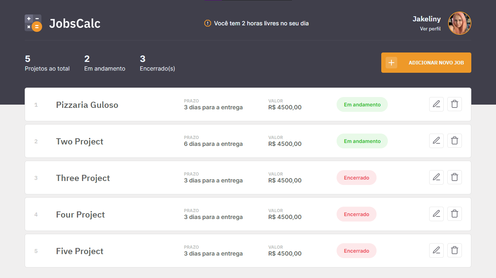

<h1 align="center"> Layout do projeto JobsCalc, da Rocketseat </h1>

## Experiência
- Habilidade de trabalhar com posicionamentos mais complexos com o CSS
- Vi a necessidade de aprender o modelo de display Grid. Usando o modelo flexbox, tive mais dificuldade para deixar o layout responsivo
- Pensar, desde o começo, em como organizar os elementos HTML para facilitar na hora de tornar a aplicação responsiva
- Naturalidade para definir os espaçamentos entre conteúdos externos e o internos, com `margin`, `paddind` e valores em `%` para o `width`

## Principal Dificuldade
- Deixar o layout responsivo

## Demonstração

